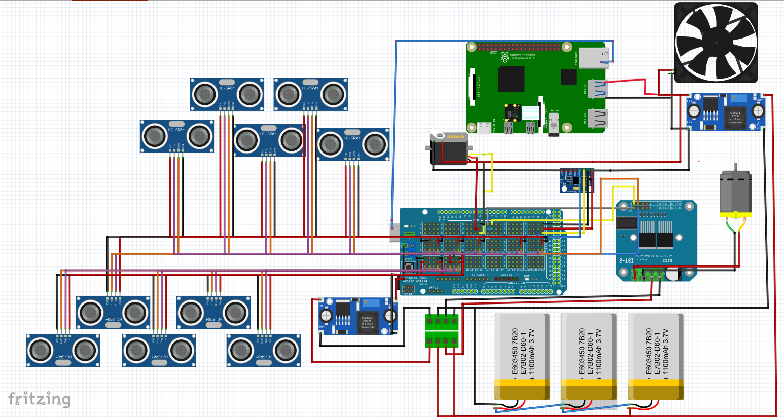

<h1 style="background-color: rgba(200, 200, 200, 0.6)">SENKU-Team soulotion_Future Engineers WRO2024</h1>

 We have solved the WRO2024 Future Engineers problem, and this repository details the development and design process of an autonomous vehicle created for participation in the WRO 2024 Future Engineers Category. The car represents a fusion of theoretical, mathematical, and mechanical engineering principles, combined with complex programming tasks and computer vision techniques. The repository provides a detailed explanation of the solution presented by the SENKU team. It includes all the steps we have undertaken in detail, along with the written codes, mechanical and electronic components used, and a comprehensive and detailed explanation of the algorithm. Additionally, it covers all the essential technical and mathematical fundamentals necessary to create the SENKU Robot vehicle and solve the problem, with the aim of providing a comprehensive information source for everyone.

Using this repository, a self-driving car can be built that is capable of completing three laps within the boundaries of the track, overcoming the obstacles present, and finally parking in a designated spot.

## Content

* `t-photos` contains 2 photos of the team (an official one and one funny photo with all team members)
* `v-photos` contains 6 photos of the vehicle (from every side, from top and bottom)
* `video` contains two .md files with links to Youtube videos for each open challenge and obstacle challenge.
* `schemes` contains several schematic diagrams for electromechanical components used in the vehicle هn addition to the complete circuit schematic, it illustrates the components and how they connect to each other.
* `src` This directorycontain the codes used during the competition, as well as all other necessary codes for testing sensors, motors, and calibration.
* `models` is for the files for models used by 3D printers to produce the vehicle elements.
* `other` Here, we have included all the auxiliary folders that contain: flowcharts used for a clearer explanation of the followed algorithms, a pictures folder containing the images used in the repository, and finally, a <a href="https://github.com/ritta36/SENKU_team-WRO2024_FutureEngineers/blob/main/README.md#introduction">Software Setup.md</a> file that provides a comprehensive and sufficient explanation of how to set up the software, install necessary applications, download libraries, and more.
<h1>Introduction</h1>

<p1>The problem we have solved involves creating a self-driving car capable of completing laps within the boundaries of the track, overcoming colored obstacles based on their color, and finally parking in a designated area within the track. To achieve this, we used electronic components with functional capabilities that serve the solution, as well as mechanical techniques that aid in movement.

Regarding the codes, we used a Python code to capture images using a camera and process them to identify the locations and colors of the obstacles, and then send the information to the Arduino board. The Arduino board uses this information along with sensor readings, which are processed using Arduino C code, to control the motors' movements to correctly navigate the obstacles and complete the laps within the track.
This repository will explain the following:
<p1>

<h2>Contents of Readme file:</h2>

<dl>
  <dt><a href="https://github.com/ritta36/SENKU_team-WRO2024_FutureEngineers/blob/main/README.md#introduction">Introduction</a></dt>
  <dt><a href="https://github.com/ritta36/SENKU_team-WRO2024_FutureEngineers/blob/main/README.md#mobility-management">Mobility Management</a></dt>
  <dd><a href="https://github.com/ritta36/SENKU_team-WRO2024_FutureEngineers/blob/main/README.md#1-vehiclemainbody">-Vehicle Main Body</a></dd>
  <dd><a href="https://github.com/ritta36/SENKU_team-WRO2024_FutureEngineers/blob/main/README.md#2-motion-mechanism">-Motion Mechanism</a></dd>
  <dd><a href="https://github.com/ritta36/SENKU_team-WRO2024_FutureEngineers/blob/main/README.md#3-engineering-principles">-Engineering Principles</a></dd>

  <dt><a href="https://github.com/ritta36/SENKU_team-WRO2024_FutureEngineers/tree/blob/main?tab=readme-ov-file#power-and-sense-management">Power and Sense Management</a></dt>
  <dd><a href="https://github.com/ritta36/SENKU_team-WRO2024_FutureEngineers/tree/blob/main?tab=readme-ov-file#1-electrical-parts">-Electrical Parts</a></dd>
  <dd><a href="https://github.com/ritta36/SENKU_team-WRO2024_FutureEngineers/tree/blob/main?tab=readme-ov-file#-2-overall-circuit-current-usage">-Overall Circuit Current Usage</a></dd>
  <dd><a href="https://github.com/ritta36/SENKU_team-WRO2024_FutureEngineers/tree/blob/main?tab=readme-ov-file#3-circuit-grounding">-Circuit Grounding</a></dd>
  <dd><a href="https://github.com/ritta36/SENKU_team-WRO2024_FutureEngineers/tree/blob/main?tab=readme-ov-file#4-power-supply">-Power Supply</a></dd>
  <dd><a href="https://github.com/ritta36/SENKU_team-WRO2024_FutureEngineers/blob/main/README.md#overall-scheme">-Overall Scheme</a></dd>
  
  <dt><a href="https://github.com/ritta36/SENKU_team-WRO2024_FutureEngineers/blob/main/README.md#obstacle-management">Obstacle Management</a></dt>
  <dd><a href="https://github.com/ritta36/SENKU_team-WRO2024_FutureEngineers/blob/main/README.md#1-open-challenge-algorithm">-Open Challenge Algorithm</a></dd>
  <dd><a href="https://github.com/ritta36/SENKU_team-WRO2024_FutureEngineers/blob/main/README.md#2-computer-vision">-Computer Vision</a></dd>
  <dd><a href="https://github.com/ritta36/SENKU_team-WRO2024_FutureEngineers/blob/main/README.md#3-image-processing">-Image Processing</a></dd>
  <dd><a href="https://github.com/ritta36/SENKU_team-WRO2024_FutureEngineers/blob/main/README.md#4-problems-we-encountered">-Problems We Encountered</a></dd>
  <dt><a href="https://github.com/ritta36/SENKU_team-WRO2024_FutureEngineers/blob/main/README.md#-suggestions-and-future-modifications">Suggestions and Future Modifications</a></dt>
  <dd><a href="https://github.com/ritta36/SENKU_team-WRO2024_FutureEngineers/blob/main/README.md#1-open-challenge">-Open Challenge</a></dd>
  <dd><a href="https://github.com/ritta36/SENKU_team-WRO2024_FutureEngineers/blob/main/README.md#2-obstacle-challenge">-Obstacle Challenge</a></dd>
  <dd><a href="https://github.com/ritta36/SENKU_team-WRO2024_FutureEngineers/blob/main/README.md#3-differential">-Differential</a></dd>
  <dd><a href="https://github.com/ritta36/SENKU_team-WRO2024_FutureEngineers/blob/main/README.md#4-micro-controller-upgrade">-Micro-controller Upgrade</a></dd>
  <dd><a href="https://github.com/ritta36/SENKU_team-WRO2024_FutureEngineers/blob/main/README.md#5--sensor-upgrades">-Sensor Upgrades</a></dd>
  <dd><a href="https://github.com/ritta36/SENKU_team-WRO2024_FutureEngineers/blob/main/README.md#6-power-management-system-pms">-Power Management System (PMS)</a></dd>
  <dt><a href="https://github.com/ritta36/SENKU_team-WRO2024_FutureEngineers/blob/main/README.md#conclusion">Conclusion</a></dt>
</dl>

  
<h2>Mobility Management</h2>

<h3>1-VEHICLEMAINBODY</h3>

The main body of the vehicle was divided into two sections. The 3D printing section comprises four parts: the upper structure, two parts forming a camera holder, and the last part serving as a battery holder.  
The second part of the structure is a chassis that features rear-wheel drive combined with a front steering mechanism, enabling it to turn both left and right. Also, it is made from aluminum which is a good material due to its lightness and durability.
The main microcontroller is an Atmega mounted on an Arduino Mega 2560 board. To ensure accurate and efficient control and direction of the vehicle’s movement, we employed several crucial components which are :
  • ServoMotorModel
  •  DC JSumo Motor 1000 RPM
  • BTSMotorDriver

The servo motor model was selected for controlling the vehicle’s steering, while the BTS7960 motor driver is utilized to control the movement of the DC motor, providing the necessary power to drive the vehicle’s motion.

<h4>2-3D Printing parts</h4>

We utilized SOLIDWORKS to design the components, followed by 3D printing these designs using PLA material. This process enabled us to create precise and customized parts for our robot, ensuring optimal performance and adherence to our design specifications. you can reach the 3D files in <a href="https://github.com/ritta36/SENKU_team-WRO2024_FutureEngineers/tree/main/models">this link.</a>

<b>Hexagonal Rod</b>

The hexagonal rod is a key component, used for providing structural support in the assembly. It features a hollow center which allows for integration with other parts.

<b>• Camera Holder</b>

The camera holder is designed to securely hold the camera in place, ensuring stability and precision in positioning. It includes both parts of the holder and the complete assembly.

<b>•  Ultrasonic Sensor Holder Base</b>

The ultrasonic sensor holder base is used to mount the ultrasonic sensor, providing a stable platform for accurate distance measurements.

<b>•  JSumo Tan Technic Gear 20 Tooth Double Bevel</b>

This gear is a crucial component in the assembly, providing the necessary transmission of motion through its double bevel design.

</li>
  <h3>3-Motion Mechanism.</h3>
  
We implemented Ackermann steering by installing a servo motor that allows the steering mechanism to operate freely. Additionally, a DC Jsumo motor with a 1000 rpm output acts as the propulsion motor. The kinetic energy produced by the Jsumo is conveyed to the rear wheels through a differential gearbox, and this energy is transmitted to the wheels via drive shafts constructed from LEGO components. Now we will explain both of the <b>Ackermann steering</b> and the <b>Differential gear:</b>

  <h4>1-Ackerman Steering Mechanism</h4>
  
Our design features an Ackermann steering mechanism, essential for providing efficient and responsive steering performance. The Ackermann steering principle is instrumental in minimizing tire wear and enhancing the vehicle's handling, especially during turns.

   
The key features and benefits of the Ackermann steering is that it enhances maneuverability by reducing tire slippage during turns. This is achieved by configuring the steering linkages to allow the inner wheel to turn at a sharper angle than the outer wheel. Each wheel follows its own natural arc around the corner, leading to more precise steering and better vehicle control. Additionally, the Ackermann steering mechanism streamlines the overall design of the steering system. It eliminates the need for complex gear arrangements, which reduces weight and potential failure points within the system. This simpler design also leads to easier maintenance and lower manufacturing costs.

<b>Working Mechanism of Ackermann Steering: </b>

The functionality of the Ackermann steering system can be summarized as follows:

<b>Steering Input Translation:</b> When the servo motor is activated, the input is conveyed through the steering linkage to both front wheels. The unique angles and lengths of the steering arms cause the inner wheel to turn more sharply than the outer wheel.

<b>Cornering:</b> During cornering, the Ackermann geometry ensures that each wheel follows its respective path, minimizing slippage and enhancing the vehicle's grip on the playing field.

<b>Key Parameters of Ackermann Steering</b>

<b>Steering Ratio:</b> In the Ackermann steering system, the steering ratio describes the relationship between the rotation of the servo angle and the resulting rotation of the wheels. It can be expressed mathematically as follows:

Steering Ratio = &theta;Servo angle / &theta;wheels

A higher steering ratio means that a smaller rotation of the servo angle results in a larger rotation of the wheels, providing greater turning capability. Conversely, a lower steering ratio requires more rotation of the servo to achieve the same amount of wheel rotation, resulting in a less sensitive steering response.

<b>Servo Motor Torque</b>

Steering torque (Tservo) is the force applied to the servo as a result of the torque output from the steering system. It is calculated by multiplying the applied force by the effective lever arm length (Leff):

<strong>Tservo = Fsteering × Leff</strong>

Higher servo motor torque indicates that more force is needed to turn the wheels, providing greater resistance to steering and a more stable driving experience.

<b>Steering Wheel Angle</b>

The steering wheel angle refers to the angular displacement of the steering wheel from its neutral position. This angle determines the orientation of the vehicle's steering mechanism and, consequently, its direction of movement:

<strong>&theta;servo = &theta;servo angle × Steering Ratio</strong>

Servo motor angle directly influences the turning radius of the vehicle, affecting its maneuverability and handling characteristics.

  
    <figcaption>Figure 20: Ackermann steering principle.</figcaption>
  </figure>

  
 
<h4>2-Differential Gear</h4>

<h4>Current Implementation and Challenges</h4>

The differential gear is a vital component in our robot, ensuring that the rear wheels can spin at different rates while maintaining balanced power distribution. This mechanism is particularly crucial during turns or when traction varies between the two wheels, allowing for smooth and controlled movement. Here’s an overview of the differential gear system and its components:

<strong>Components:</strong>
<ol>
    <li><strong>Ring Gear:</strong> This large gear, attached to the axle shaft, receives power from the engine or driveshaft.</li>
    <li><strong>Pinion Gear:</strong> A smaller gear that connects to the drive shaft and meshes with the ring gear.</li>
    <li><strong>Side Gears:</strong> Two gears that link the differential to the axle shafts.</li>
    <li><strong>Spider Gears:</strong> Positioned between the side gears, these gears permit the wheels to rotate at varying speeds.</li>
</ol>

<figcaption>Figure 21: Lego Differential Gear</figcaption>
</figure>
 
 
<strong>Functionality:</strong>

When the vehicle travels in a straight line, the differential distributes torque equally to both wheels. During a turn, the inside wheel (closer to the center of the turn) needs to rotate slower than the outside wheel to prevent slippage. The differential achieves this by allowing the side gears to rotate at different speeds while still distributing power effectively.

<strong>Calculating Gear Ratio:</strong>

Before designing a differential gear, determining the gear ratio is crucial. This involves understanding the motor specifications and the differential’s mechanical setup. The gear ratio can be calculated by counting the teeth on the ring gear and the side gears:

$$ \text{GR} = \frac{R}{S1 + S2} $$

Where:

<ul>
    <li><code>R</code> is the number of teeth on the ring gear.</li>
    <li><code>S1</code> and <code>S2</code> are the number of teeth on each side gear.</li>
</ul>

This ratio indicates the rotational speed and torque distribution between the two side gears of the differential. Once calculated, this ratio helps relate the motor speed to the wheel speed. The wheel speed Nwheel can be derived from the motor’s no-load speed NMotor, no-load using the formula:

 $$ N_{\text{wheel}} = \frac{N_{\text{Motor, no-load}}}{\text{GR}} $$ 

The wheel speed reflects the rotational speed of the differential’s side gears, directly influencing the vehicle’s speed. While theoretical calculations provide a baseline, real-world values often require calibration due to various unaccounted constraints.

<h4>Suggestions and Future Modifications</h4>

<strong>Current Differential Issues:</strong>

In our current design, we utilized a LEGO differential; however, we observed several shortcomings, specifically its low durability and the high flexibility of the LEGO axles.

<strong>Recommended Differential Upgrade:</strong>

To enhance the vehicle’s performance, we recommend using a metal differential with metal axles, which offer greater durability and reduced flexibility. This upgrade will ensure:

<ul>
    <li><strong>Increased Durability:</strong> Metal differentials are more robust and can withstand higher stress and load without failing, ensuring longer operational life and reliability.</li>
    <li><strong>Reduced Flexibility:</strong> Metal axles are less flexible compared to LEGO axles, resulting in more precise and consistent power transmission to the wheels, improving overall vehicle control.</li>
</ul>

<strong>Impact on Vehicle Performance:</strong>
<ul>
    <li><strong>Enhanced Stability:</strong> The reduced flexibility and increased robustness of the metal components will provide greater stability, particularly during turns and when navigating uneven terrain.</li>
    <li><strong>Improved Power Transmission:</strong> The precise and consistent power transmission afforded by metal axles will enhance the vehicle’s responsiveness and maneuverability.</li>
    <li><strong>Long-Term Reliability:</strong> The durability of metal differentials ensures that the vehicle can operate under demanding conditions without frequent maintenance or replacement of parts.</li>
</ul>

Implementing these modifications will significantly improve the vehicle's performance, making it more reliable and efficient in navigating the challenges of the competition.

<h4> 3-Motor Driver</h4>

A motor driver is an indispensable device in controlling motors because it allows the safe handling and delivery
of required power for driving the motor; at the same time, it includes protection features to guard against
damage under abnormal operating conditions. In addition, the motor driver provides accurate control, speed,
direction, and acceleration. A driver is a must for those applications that require precise positioning or motion
control, as in our case. It has bidirectional control, works with various motor types, and optimizes power usage
for more efficiency

<figure>

   
<figure >Figure 4: Basic-open loop control of motor speed</figcaption>
</figure>
 
  

<h4>4- Wheels</h4>

Wheels were used in the robot's design, their advantage comes from their efficiency and light weight. These wheels provide good friction, which enhances stability and maneuverability on various surfaces. [26]

<caption><strong>Figure 23:</strong> Wheel</caption>
<table>
    <caption>Table 1: Specifications of 65mm Rubber Wheels</caption>
    <tr>
        <th>Specification</th>
        <th>Details</th>
    </tr>
    <tr>
        <td>Diameter</td>
        <td>65mm</td>
    </tr>
    <tr>
        <td>Width</td>
        <td>25-30mm</td>
    </tr>
    <tr>
        <td>Material</td>
        <td>Rubber tire with plastic or metal hub</td>
    </tr>
    <tr>
        <td>Axle Hole</td>
        <td>Compatible with standard hex couplings (often 4mm or 6mm)</td>
    </tr>
    <tr>
        <td>Coupling Type</td>
        <td>Lengthen copper coupling with hex connection</td>
    </tr>
    <tr>
        <td>Weight</td>
        <td>Usually light, suitable for small to medium-sized RC vehicles</td>
    </tr>
    <tr>
        <td>Use</td>
        <td>Suitable for DIY projects, Arduino smart car chassis, and other robotics applications</td>
    </tr>
</table>

<h4>5- Lego Axles</h4>

Using the LEGO axles (4.8mm Diameter) on both the differential gears mechanism and the wheels connecting leads to a significant improvement in the robot's efficiency. The axles deliver accurate rotary motion while cutting down friction and energy losses. It is made of PA (Polyamide), which is a type of material that can withhold high loads and impacts. This means it is suitable for elements that have to be tough and can interact with each other, thus enabling a smooth power transmission of prolonged operation.

<caption><strong>Figure 24:</strong> Lego Axle</caption>

<h3>3-Engineering Principles</h3>
  
The selection of materials and components for our vehicle was guided by several key engineering principles:

  <ul>
    <li><strong>Torque and Speed Calculations:</strong> The motors were chosen based on the required torque to overcome friction and inertia, ensuring sufficient speed for the competition.</li>
    <li><strong>Material Selection:</strong> Aluminum was selected for its strength-to-weight ratio, providing a lightweight yet durable structure.</li>
    <li><strong>3D Printing Selection:</strong> PLA is easy of Printing, Strength and aligns with sustainable engineering practices, making it an eco-friendly choice.</li>
    
  </ul>
<h2>Power and Sense Management</h2>

 <h3>1-Electrical Parts</h3>
    <section>
        <b>Section 2, Subsection 1</b>
        <ol>
            <li>
                <strong>Arduino Mega 2560:</strong>
                <ul>
                    <li>Microcontroller: ATmega2560</li>
                    <li>Features: 54 digital I/O pins, 16 analog inputs, USB interface, operates at 5V</li>
                    <li>Used for complex and resource-intensive projects due to ample processing power and memory.</li>
                </ul>
            </li>
            <li>
                <strong>Arduino Sensor Shield v2.0:</strong>
                <ul>
                    <li>Designed for Arduino Mega 2560</li>
                    <li>Features: Easy connection for sensors and modules, supports I2C, UART, and analog interfaces</li>
                    <li>Provides convenience and flexibility in connecting multiple components to the Arduino board.</li>
                </ul>
            </li>
            <li>
                <strong>Raspberry Pi 4 Model B:</strong>
                <ul>
                    <li>Processor: Broadcom BCM2711, quad-core Cortex-A72</li>
                    <li>Features: Dual micro HDMI ports, wireless LAN, Bluetooth 5.0, USB 3.0, up to 8GB RAM</li>
                    <li>Suitable for projects requiring substantial processing power and connectivity.</li>
                </ul>
            </li>
            <li>
                <strong>Cooling Fan:</strong>
                <ul>
                    <li>Used to reduce overheating in Raspberry Pi and enhance CPU performance</li>
                    <li>Essential for maintaining optimal operating temperatures and prolonging the lifespan of the device.</li>
                </ul>
            </li>
            <li>
                <strong>Raspberry Camera Module 3 (75 degrees FoV):</strong>
                <ul>
                    <li>Sensor: Sony IMX708, 11.9 Megapixels</li>
                    <li>Features: Motorized focus, wide field of view suitable for detecting obstacles and ensuring effective image processing.</li>
                </ul>
            </li>
            <li>
                <strong>BTS7960 Motor Driver:</strong>
                <ul>
                    <li>H-Bridge configuration, supports motors between 5V and 27V</li>
                    <li>Features: current sensing and protection against overcurrent and overtemperature</li>
                    <li>Useful in robotics for precise motor control.</li>
                </ul>
            </li>
            <li>
                <strong>XL4005 DC-DC Step-Down Converter:</strong>
                <ul>
                    <li>Input: 5V to 32V, Output: Adjustable from 0.8V to 30V, up to 5A current</li>
                    <li>High efficiency and includes features like thermal shutdown and short circuit protection</li>
                    <li>Converts high voltage to a lower voltage while maintaining high efficiency.</li>
                </ul>
            </li>
            <li>
                <strong>TowerPro MG996R Servo:</strong>
                <ul>
                    <li>High torque with metal gears, operates from 4.8V to 7.2V</li>
                    <li>Provides precise control suitable for robotics applications requiring robust actuation.</li>
                </ul>
            </li>
            <li>
                <strong>Li-Poly RC Battery:</strong>
                <ul>
                    <li>11.1V, 2700mAh with a 35C discharge rate</li>
                    <li>Provides high power and efficiency for demanding applications like RC vehicles.</li>
                </ul>
            </li>
            <li>
                <strong>JSumo 1000 RPM Motor:</strong>
                <ul>
                    <li>12V operation, 1000 RPM no-load speed</li>
                    <li>High power motor, ideal for robotics and sumo robot competitions.</li>
                </ul>
            </li>
            <li>
                <strong>MPU-6050 Sensor:</strong>
                <ul>
                    <li>Combined 3-axis gyroscope and accelerometer</li>
                    <li>Useful for motion sensing and orientation tracking in robotics.</li>
                </ul>
            </li>
            <li>
                <strong>HC-SR04 Ultrasonic Sensor:</strong>
                <ul>
                    <li>Measures distance using ultrasonic waves</li>
                    <li>Employed in robotics for obstacle detection and navigation.</li>
                </ul>
            </li>
        </ol>
    </section>

<h3> 2-Overall Circuit Current Usage</h3>
 
 here are many reasons why it is important to have an accurate knowledge of the electrical component requirements which include

    <ol>
        <li>
            <strong>Dual Mode (Operational and Sleep):</strong>
            
The power supply system is programmed to handle different current requirements when the robot is active (Operational) and when it is in a power-saving mode (Sleep). This helps in ensuring that the robot operates efficiently without draining unnecessary power when not performing intensive tasks.

        </li>
        <li>
            <strong>Optimize for Battery Life:</strong>
            
Understanding the power consumption of each component is essential for optimizing battery life. By analyzing the current draw in various operational states, strategies can be developed to extend battery life, such as selecting the appropriate batteries and implementing power-saving modes.

        </li>
        <li>
            <strong>Heat Management:</strong>
            
The total current load on a circuit contributes to the amount of heat generated by electrical components. Knowing this helps in designing effective cooling measures, which are crucial for preventing overheating that could lead to performance degradation or hardware damage.

        </li>
        <li>
            <strong>Safety:</strong>
            
Accurate knowledge of the maximum current that each component draws is essential for designing a safe electrical system. This includes ensuring that all components can handle the peak currents under load without risk of electrical failures or hazards.

        </li>
        <li>
            <strong>Cost Efficiency:</strong>
            
By understanding the exact power needs of each component, more cost-effective components and systems that meet the necessary specifications without excess can be selected.

        </li>
    </ol>

<h3>3-Circuit Grounding</h3>
    
Circuit grounding connects all components with a common ground, providing a reference point for all voltages in the circuit and dramatically simplifying the measurement of voltage at any point in the circuit. It ensures the signal moves accurately without distortion, prevents electrical shocks, and safeguards the equipment, as well as people, from hazards that can arise otherwise.

    
Grounding reduces electromagnetic interference (EMI) and radio frequency interference (RFI) by allowing a path for unwanted currents to dissipate harmlessly into the ground. This can greatly improve the performance and overall reliability of the circuit. Grounding stabilizes the voltage levels, preventing voltage fluctuation by ensuring a consistent electrical potential across all components. It may also help in reducing some noise and interference within the circuit. When several sections of the circuit share a common reference point, one can better filter noise and interference.

  <h3>4-Power Supply</h3>
    
In the revised setup, an 11.1V – 2700mAh 35C Li-Poly RC battery is used as the power source, which directly provides 11.1V to both the BTS motor driver and the RioRand step-down DC-DC converter. The converter adjusts the voltage from 11.1V down to 5V to power the Arduino board. Additionally, the Arduino Sensor Shield, which conveniently offers the GND and VCC pins for connecting ultrasonic sensors, a servo motor, and a gyroscope without the need for a bridge or extra pins. This configuration results in a visually pleasing circuit that provides easy access to all pins and simplifies the troubleshooting of faults and issues. The DC motor receives power directly from the battery through the BTS motor driver, maintaining the supply at 11.1 volts.

  <h3>5-Overall Scheme</h3>
    
Due to the large number of electronic components used in our circuit, we utilized a special power supply distribution using basic electronic components. The description below provides an overview of the electrical design:

 
 
 

<caption><strong>Figure 25:</strong> The Circuit Wiring.</caption>
 
 
  

 
<caption><strong>Figure 26:</strong> The Circuit Wiring Diagram.</caption>
 

<h2>Obstacle Management</h2>

<h3>1-Open Challenge Algorithm</h3>

In this section, we detail our approach for the Open Challenge, where the goal is to complete three laps while avoiding collisions with the track walls and achieving the fastest possible time. Our strategy involves designing a robust algorithm that ensures precise navigation and smooth transitions between different segments of the track. The track is divided into two primary zones: the Safe Zone and the Danger Zone, each requiring distinct handling strategies.

<figcaption>Figure 27: zones Division
</figcaption>
</figure>
<h4> Safe Zone Navigation</h4>

In the Safe Zone, the robot can move safely without the risk of colliding with the wall. The robot should maintain a straight path parallel to the wall. This is managed using a PD (Proportional-Derivative) controller that keeps the robot's angle constant. The gyroscope readings are used as inputs to the algorithm, and the setpoint is adjusted after each turn. The PD controller formula used is:

<pre>PIDOutput = K_p &times; Error_t + (Error_t - Error_{t-1}) / IntervalLength &times; K_d</pre>

Where:

  <li><i>Error_t = GyroscopeReading - SetPoint</i></li>

<h4> Danger Zone Handling</h4>

When the robot enters the Danger Zone, immediate corrective action is required to move it back to the Safe Zone. For this, we employ a P (Proportional) controller with a high proportional gain:

<pre>ServoAngle = K_p &times; (D_{vertical} - D_{unprotected})</pre>

Where:

  <li><i>D_{vertical} = cos(Angle) &times; DS1 + DS2 / S2</i></li>

<h4> Turn Detection and Direction Control</h4>

The robot detects turns at distances greater than 100 cm. If it cannot align parallel to the wall, incorrect ultrasonic readings might occur. In such cases, the robot uses its front ultrasonic sensor to detect the front wall and, if a safe turn is not possible, it moves backward until a safe turn can be made. The robot determines the movement direction (clockwise or counterclockwise) based on which side the turn is detected.

Overall, this algorithm ensures the robot navigates efficiently through the track, handling turns and zones with precise control to achieve the fastest lap times possible.

<figcaption>Figure 28: Open challenge flowchart
</figcaption>
</figure>

  <h3>2-Computer Vision</h3>
    
Computer vision is a fundamental technology in robotics and automation, crucial for enabling self-driving cars to perceive and interpret their surroundings. In our project, computer vision (CV) techniques empower the robotic system to gather essential information, facilitating informed decision-making and immediate actions. The identification of the pink
 parking, red and green pillars is critical for collision avoidance and maintaining a clear path for the robot.

    
   
We employ the HSV (Hue, Saturation, Value) color space for color detection due to its robustness under varying lighting conditions. Unlike other color spaces such as RGB (Red, Green, Blue) or HSL (Hue, Saturation, Lightness), HSV separates color information (hue) from luminance, enhancing its reliability.

    
  <b>HSV Color Space</b>
    <ul>
        <li><strong>Hue:</strong> Represents the type of color, measured as an angle in degrees (0-360), where red = 0, green = 120, blue = 240.</li>
        <li><strong>Saturation:</strong> Indicates the vibrancy of the color, ranging from 0 (gray) to 100 (full color).</li>
        <li><strong>Value:</strong> Defines the brightness of the color, with 0 as black (no brightness) and 100 as fully bright.</li>
    </ul>
    
  <b>Advantages of HSV over RGB for Color Detection</b>
    <ul>
        <li><strong>Decomposition of Color and Luminance:</strong> HSV effectively separates hue from saturation and value, making hue less affected by lighting changes and enabling more accurate region detection. RGB combines intensity with colors, complicating the appearance of hues under varying light.</li>
        <li><strong>Improved Color Filtering:</strong> HSV filters colors based on human perception, making it easier to isolate specific hues. In contrast, RGB colors can vary significantly with brightness changes.</li>
        <li><strong>Lighting Robustness:</strong> HSV is more resilient to lighting variations, as changes in light intensity affect hue less than in RGB, allowing for consistent color matching.</li>
    </ul>

   
Using HSV for computer vision in our project enhances the accuracy and reliability of color detection, crucial for the robot's autonomous navigation and obstacle avoidance.

 
<figcaption>Figure 29: RGB photo 
</figcaption>
</figure>
 
 
    

 
<figcaption>Figure 30: HSV photo
</figcaption>
</figure>
 
 
 

<h3>3-Image Processing</h3>

  <h4>Setting the Camera Properties</h4>
    
The camera's shutter speed is adjusted according to the ambient lighting conditions. Shutter speed defines the duration for which the camera’s shutter remains open, allowing light to reach the camera sensor. In high-brightness environments, we reduce the shutter speed to limit the amount of light hitting the sensor during the calibration of HSV values. Conversely, in low-light conditions, we increase the shutter speed to allow more light to reach the sensor.

  <h4>Pre-Processing</h4>
    
Pre-processing is essential before isolating the pillars to extract information. This step involves cleaning the captured images to remove unwanted artifacts, ensuring more accurate and reliable segmentation results. Cropping the frame removes distracting elements that might be mistaken for pillars.

  <h4>Masking</h4>
    
To isolate specific colors, the image is first converted from the BGR color space to the HSV color space. We then identify the upper and lower HSV values of the target colors (red, green, or pink). Each pixel in the HSV frame is examined to determine if it falls within the specified color range. If it does, the corresponding pixel value in the mask will be white; otherwise, it will be black. The resulting mask frame will display white pixels for the desired color range and black pixels for all other colors.

  
Our HSV values:

    <ul>
        <li><strong>Red1:</strong> Lower value: [], Upper value: []</li>
        <li><strong>Red2:</strong> Lower value: [], Upper value: []</li>
        <li><strong>Green:</strong> Lower value: [], Upper value: []</li>
        <li><strong>Pink:</strong> Lower value: [], Upper value: []</li>
    </ul>
    
Note: HSV values may vary under different lighting conditions.

| Original Frame | Mask | Result |
|----------------|------|--------|
|  |  |  |
| **Original Frame** | **Mask** | **Result** |
| **Figure 31: Red 1 Mask Analysis** |

| Original Frame | Mask | Result |
|----------------|------|--------|
|  |  |  |
| **Original Frame** | **Mask** | **Result** |
| **Figure 32: Red 2 Mask Analysis** |

| Original Frame | Mask | Result |
|----------------|------|--------|
|  |  |  |
| **Original Frame** | **Mask** | **Result** |
| **Figure 33: Green Mask Analysis** |

  <h4>Contouring</h4>
    
Contour detection is the process of identifying the boundaries or edges of objects within an image. This process is fundamental to many image analysis applications, including image segmentation, object recognition, and classification.

     
 
<figcaption>Figure 34: Contouring Process
</figcaption>
</figure>
 
 

   
<strong>Steps in the Contouring Process:</strong>

    <ol>
        <li>Finding the Contour Area:
            <pre>cv2.contourArea(contour)</pre>
        </li>
        <li>Finding the Bounding Rectangle:
            <pre>cv2.boundingRect(contour)</pre>
        </li>
        <li>Finding the Moment:
            <pre>cv2.moments(contour)</pre>
        </li>
        <li>Calculating Distance: The distance is calculated using a formula derived by plotting a curve between the actual distance and the contour area.</li>
    </ol>

<strong>Figure 30: Contouring Analysis</strong>

  <h4>Our Algorithm to Avoid the Pillars</h4>
    
At the start of each section, the Raspberry Pi captures an image using the camera. It processes the image and applies a mask to detect any pillars in front of the vehicle. If a pillar is detected and the distance is less than 50 cm, the Raspberry Pi sends a signal to the Arduino ('G' for a green pillar, 'R' for a red pillar, and 'N' for no pillar). The Arduino then decides the course of action: turn left for 'G', turn right for 'R', or move forward for 'N'.

 
<figcaption>Figure 32:  the vehicle parking in the corner
</figcaption>
</figure>
 
 

When the vehicle reaches a corner, the Arduino determines the direction of movement and communicates this to the Raspberry Pi ('L' for counterclockwise and 'R' for clockwise). At the end of each section, the Arduino sends a 'Hello' message to the Raspberry Pi, prompting it to take an image, process it, and report the current status back to the Arduino. The possible status cases are GG, G, RR, R, RG, and GR.

<h3>4-Problems We Encountered</h3>

  <h4>Wave Interference</h4>
    
When two sensors on the same side of the robot operate simultaneously, the sound waves they emit can interfere with each other. To address this issue, we implemented a method where only sensors on opposite sides operate at any given time while the other sensors are disabled. Specifically, we take readings sequentially from R1 and L2, then R2 and L1, followed by F and B. This approach prevents wave interference during distance measurements.

  <h4>Small Turn Angle and Sliding</h4>
    
Initially, the robot experienced issues with a small turn angle and sliding, primarily due to the absence of a differential gear. This caused the robot to require a large distance to achieve the desired turn angle, and the front tires often slipped. We resolved these problems by integrating a differential gear, which enhanced the turning capability and stability of the robot.

  <h4>Flickering</h4>
    
Flickering refers to the visible fluctuation in brightness or color in video frames, which can occur rapidly and intermittently. We encountered this issue with the Raspberry Pi 4 and Camera Module 3 setup. Flickering can make the video output appear unstable and less effective for its intended use. We resolved this by adjusting the camera's shutter speed:

   <pre>picam2.set_controls({"ExposureTime": shutter_speed})</pre>

  
This adjustment stabilized the video output, ensuring reliable performance for image processing tasks.

  <h2> Suggestions and future modifications</h2>

  <h3>1-Open Challenge</h3>
  

    Sometimes, the use of a gyroscope sensor can result in incorrect setpoint calculation. There is evidence for this in that after the robot has turned, it may not be turned precisely 90 degrees, maybe less or more. So, a correction formula is applied that corrects the reading from the gyro and calculates the correct set point.
  

  
<strong>Angle Calculation Formula:</strong> Angle = atan-1((DS1 - DS2) / DS1S2)

 
  <figure>
    
      
    <figcaption>Figure 33: Angle Calculation</figcaption>
  </figure>
   
    
  

    Final output can be calculated using the formula below:
  

  
<strong>Servo Angle Formula:</strong> ServoAngle = Angle + PIDOutput

  <dl>
    <dt>PIDOutput</dt>
    <dd>is the calculated servo angle using PD only.</dd>
    <dt>SetPoint</dt>
    <dd>is the reference angle (in which the robot is parallel to the wall).</dd>
    <dt>Error</dt>
    <dd>is the difference between the current reading and SetPoint in time <em>t</em>.</dd>
    <dt>Kp</dt>
    <dd>is the proportional gain.</dd>
      <dt><strong>Kd</strong></dt>
  <dd>is the derivative gain.</dd>
  <dt><strong>IntervalLength</strong></dt>
  <dd>is the time period to take one measurement.</dd>
  <dt><strong>DS1</strong></dt>
  <dd>is the front right/left sensor reading.</dd>
  <dt><strong>DS2</strong></dt>
  <dd>is the rear right/left sensor reading.</dd>
  <dt><strong>DS1S2</strong></dt>
  <dd>is the distance between the front right/left sensor and the rear right/left sensor.</dd>
  <dt><strong>Angle</strong></dt>
  <dd>is the angle between the robot and the wall.</dd>
  <dt><strong>ServoAngle</strong></dt>
  <dd>is the final servo angle.</dd>
  </dl>

<section>
  <h3>2-Obstacle Challenge</h3>
  

    There are a few issues with the current vehicle, which utilizes Raspberry Pi Camera Module 3. For this, we suggest upgrading to the Intel RealSense Depth Camera D435 since it will resolve all of these issues and improve reliability in general. The camera is used to provide accurate depth perception so it can measure how far away Pillars and other solid obstacles are. In addition, a wider field of view helps detect obstacles. Its integrated Inertial Measurement Unit (IMU) provides motion tracking better depth accuracy and more stable than ever. This is especially useful in dynamic environments where the vehicle needs to quickly respond.
  

</section>
<section>
  <h3>3-Differential</h3>
  

    In our current design, we utilized a LEGO differential; however, we observed some shortcomings, specifically its low durability and the high flexibility of the LEGO axles. To enhance the vehicle’s performance, we recommend using a metal differential with metal axles, which offers greater durability and reduced flexibility.
  

</section>
<section>
  <h3>4-Micro-controller Upgrade</h3>
  

    In our vehicle, we utilized an Arduino Mega 2560 to control the motors and process sensor outputs, and a Raspberry Pi 4 with a camera to capture images, detect pillars, and send signals to the Arduino for appropriate actions. However, we observed some limitations, particularly in the computational power and integration complexity of using two separate devices. To enhance the system’s performance and streamline the architecture, we recommend using an NVIDIA Jetson Nano. The Jetson Nano provides significantly more computational power, allowing for advanced algorithms, real-time data processing, and machine learning applications. Designed specifically for AI applications, it can handle deep learning and image processing tasks, which are essential for complex navigation and obstacle avoidance. This upgrade would consolidate the tasks currently managed by both the Raspberry Pi 4 and the Arduino into a single, more powerful unit.
  

<h3>5- Sensor Upgrades</h3>

  <b>Distance Measurement</b>
  

    The current setup using Ultrasonic Sensors (HC-SR04) presents several limitations. To address these issues and improve system reliability, we recommend upgrading to Time-of-Flight (ToF) Sensors (VL53L1X) or LiDAR (RPLIDAR A1). This upgrade will resolve the existing problems (e.g., delay in responding) and enhance overall performance. ToF sensors and LiDAR deliver more accurate distance measurements, which are crucial for detecting how far away the surrounding objects are. Furthermore, they offer a faster response time, essential for real-time wall and obstacles detection. Both sensors also provide better range and resolution, significantly boosting navigation capabilities.
  

</section>
<section>
  <b>MPU Upgrade</b>
  

    We identified some shortcomings in accuracy and stability with the MPU-6050 used in our current vehicle. To address these issues and improve the system’s performance, we suggest upgrading to the Bosch BNO055. The BNO055 features an advanced 9-axis sensor with integrated sensor fusion algorithms, offering enhanced accuracy in orientation and motion tracking. Additionally, it provides better stability by effectively managing drift and noise, ensuring consistent performance in dynamic environments.
  

</section>
<section>
  <h3>6-Power Management System (PMS)</h3>
  

    Our current design employs basic power distribution using a Li-Poly battery and DC-DC converters; however, there are opportunities to improve battery management and power stability. To address these issues, we suggest upgrading to a Battery Management System (BMS). A BMS monitors individual cell voltages, temperatures, and overall battery health, which helps extend battery life and ensures safe operation. Additionally, it provides efficient power distribution to all components, maintaining stable voltage levels and preventing power fluctuations.
  

</section>
<h2>Conclusion</h2>

In conclusion,the autonomous vehicle we made is designed to compete in the WRO 2024 Future Engineers Category. This car embodies a blend of theoretical and practical principles from mechanical and mathematical engineering, alongside intricate programming challenges and advanced computer vision techniques. We aim to contribute to the advancement of autonomous vehicles, recognizing their immense potential to transform global mobility and connectivity.
  and also to provid a rich informational resource that encompasses all the necessary knowledge from mechanical components to the details of software and computing needed for operation, this is intended for those who lack a source to aid them in similar endeavors.

