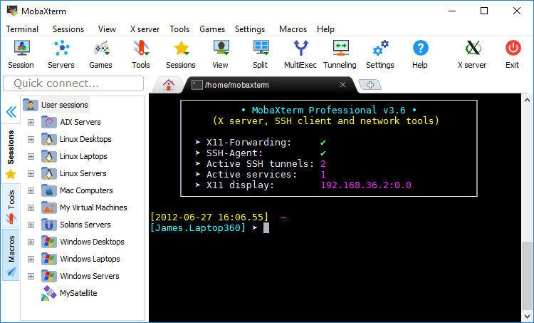
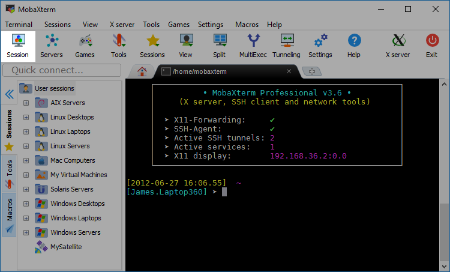
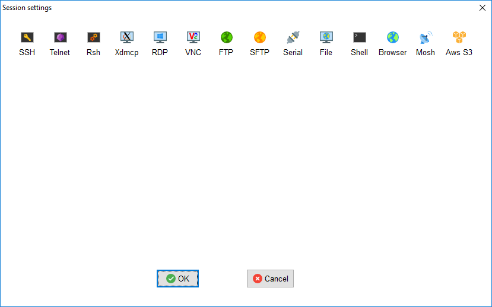
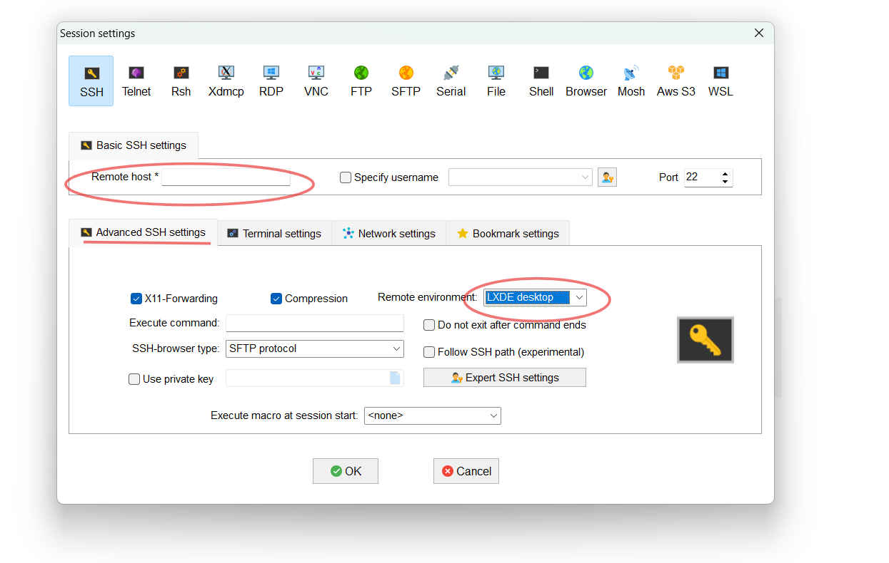
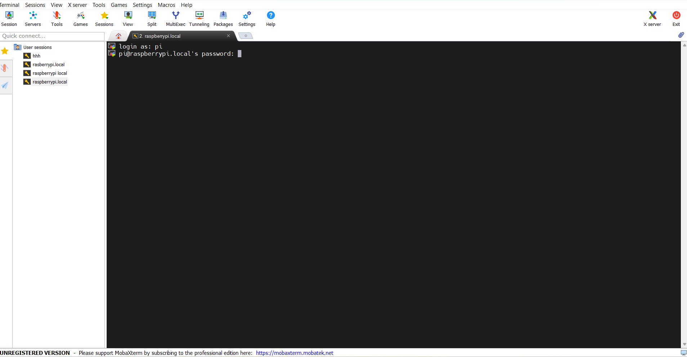
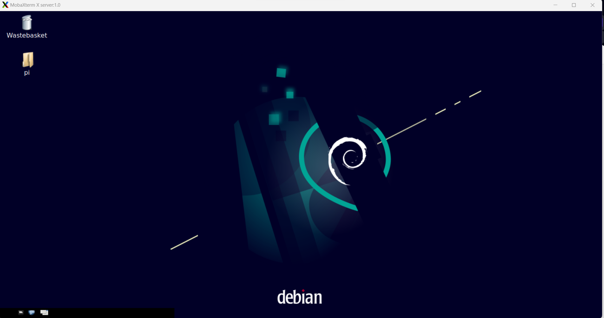
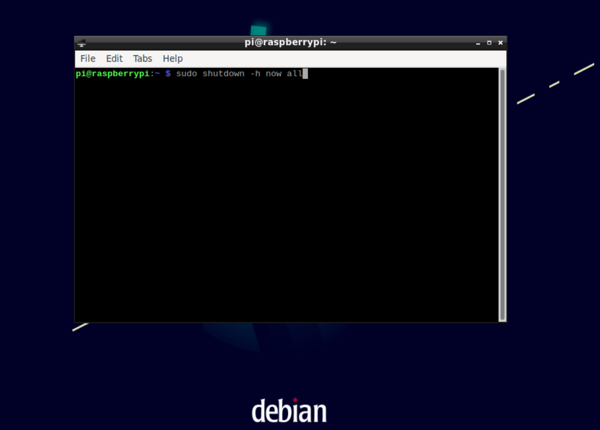
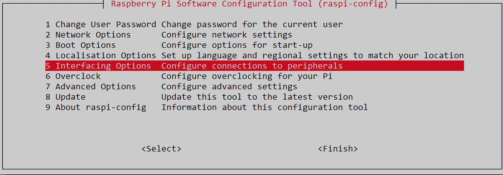
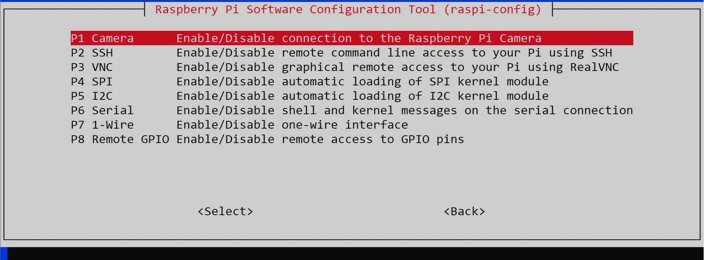
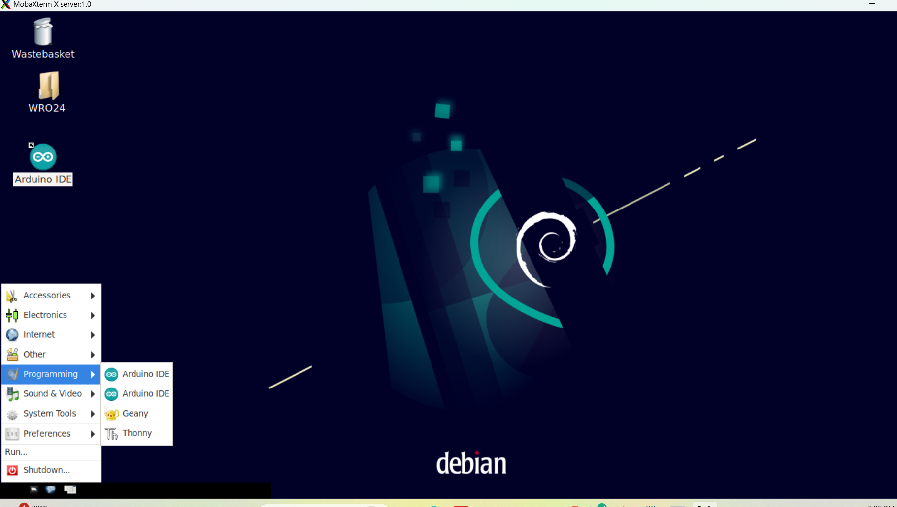

<h2>Contents</h2>

<dl>
  <dt><a href="https://github.com/ritta36/SENKU_team-WRO2024_FutureEngineers/new/main/other#software-setup">Software Setup</a></dt>
  <dd><a href="https://github.com/ritta36/SENKU_team-WRO2024_FutureEngineers/new/main/other#1--setting-up-and-configuring-for-raspberry-pi">-Setting Up and Configuring for Raspberry Pi</a></dd>
  <dd><a href="https://github.com/ritta36/SENKU_team-WRO2024_FutureEngineers/new/main/other#configuring-remote-access-for-raspberry-pi">-Configuring Remote Access for Raspberry Pi</a></dd>
  <dd><a href="https://github.com/ritta36/SENKU_team-WRO2024_FutureEngineers/new/main/other#3--activating-the-raspberry-pi-camera">- Activating the Raspberry Pi Camera</a></dd>
  <dd><a href="https://github.com/ritta36/SENKU_team-WRO2024_FutureEngineers/new/main/other#-6--downloading-the-pyserial-library">- Downloading OpenCV library on Raspberry Pi.</a></dd>
  <dd><a href="https://github.com/ritta36/SENKU_team-WRO2024_FutureEngineers/new/main/other#5--downloading-opencv-library-on-raspberry-pi">- Downloading the PySerial Library.</a></dd>
  <dd><a href="https://github.com/ritta36/SENKU_team-WRO2024_FutureEngineers/new/main/other#7--downloading-picamera2-library">- Downloading Picamera2 library</a></dd>
  <h2>Software Setup</h2> 

For effective applying to our self-driving car project, it's essential to configure software and install specific applications.We will be using Raspberry Pi for image processing, therefore, we will need to set up the <b>Raspberry Pi</b> device as well as enable and establish a remote connection for the Raspberry Pi.We will also need to activate the camera and download the applications that provide the necessary work environment for the accompanying codes. For this purpose, we will require the following applications:

<h3>1- Setting Up and Configuring for Raspberry Pi</h3>

Before you can use and control your Raspberry Pi, you must set up your Raspberry. To operate it, an operating system is required.you can install an operating system using <b>Imager</b> as follows:

<ol type="I">
  <li>Download the latest version from <a href="raspberrypi.com/software">Raspberry PiOS</a>  and run the installer. Once you’ve installed Imager, launch the application by clicking the Raspberry Pi Imager icon </li>
   

    
    <figcaption>Figure 1: The list of Raspberry Pi's models</figcaption>
  </figure>
  <li>Select "Choose device" and pick your Raspberry Pi model from the dropdown list.(we are using Raspberry pi 4 in our Vehicle)</li>
   
      
  
    <figcaption>Figure 2:Picking your Raspberry Pi model</figcaption>
  </figure>
   <li>Next, click Choose OS and select an operating system to install</li>
    

  
    <figcaption>Figure 3: Selecting an operating system</figcaption>
  </figure>
   <li>Attach your chosen storage device to your computer. For instance, insert a microSD card via an external or integrated SD card reader. Subsequently, click on "Choose storage" and select the appropriate storage device.</li>
    
   
  
    <figcaption>Figure 4:Choose storage</figcaption>
  </figure>
   <li>Imager will prompt you to apply operating system customizations. It is highly advisable to configure your Raspberry Pi using these OS customization settings. Select the "Edit Settings" button to access the OS customization options.</li>
    

   <li>Upon accessing the OS customization menu, you may encounter a prompt to import Wi-Fi credentials from your current computer. Agreeing will automatically fill in the details from the network you are connected to, while declining allows for manual entry. 

The hostname setting allows your Raspberry Pi to be identified on the network via mDNS, making it accessible at <hostname>.local or <hostname>.lan.
You can set the administrative username and password under the username and password options.
The wireless LAN setting enables you to specify the SSID (name) and password for your network. For non-public SSIDs, activate the "Hidden SSID" option. 
 
Lastly, the locale settings allow customization of the time zone and keyboard layout for your Raspberry Pi.</li>
 

    <figcaption>Figure 5: OS customization options.</figcaption>
  </figure>

   <li>The Services tab contains options that facilitate remote access to your Raspberry Pi.

To manage your Raspberry Pi remotely via your network, ensure the Enable SSH box is checked. This is recommended for operating a headless Raspberry Pi.

Select the password authentication method for SSH access to your Raspberry Pi using the username and password set in the general tab of the OS customization.</li>
 

 <figcaption>Figure 6: Selecting the password authentication method</figcaption>
  </figure>
   <li>After you have completed entering the OS customization settings, click "Save" to preserve your configurations.</li>
    

   <li>Next, select "Yes" to confirm and apply the OS customization settings while writing the image to the storage device.</li>
    

   <li>Lastly, confirm your action by clicking "Yes" in response to the "Are you sure you want to continue?" prompt, initiating the process of writing data to the storage device.</li>
  
 

   <li>If an administrative prompt appears requesting permissions to read and write to your storage medium, grant the necessary permissions to Imager to continue.(you will have to wait, this takes a few minutes).</li>
  
     
    <figcaption>Figure 7: Writing page</figcaption>
  </figure>

   <li>When you see the "Write Successful" popup, your image has been completely written and verified. You’re now ready to boot a Raspberry Pi from the storage device!</li>
 </ol>

 <h3>2- Configuring Remote Access for Raspberry Pi</h3>

There are many ways to control your Raspberry Pi, but you will need to access a Raspberry Pi without connecting it to a monitor, keyboard, and mouse. we will need to manage it remotely to facilitate working on the car, and therefore we will need the following:

To manage your Raspberry Pi from a different device within your local network, consider utilizing <b>SSH</b>.  SSH (Secure Shell) is a protocol designed to establish a secure connection for remote access and management of systems such as the Raspberry Pi. By encrypting the data exchange between a local computer and a remote device, SSH facilitates the secure execution of commands, transfer of files, and administration of systems from a distance. This capability is particularly advantageous for managing Raspberry Pi configurations that lack direct physical access. Utilizing SSH allows for the effective control and setup of the Raspberry Pi from a separate computer via the network.

MobaXterm is the software that facilitates this communication, utilizing the SSH protocol.

<ol type="I">
  <li> Download the software from the <a href="https://mobaxterm.mobatek.net/download-home-edition.html">provided link</a> and select the portable edition.</li>
   
  
  
  <li>After downloading the software, extract it to a designated folder. The program will be ready for use once launched. Ensure that both the Raspberry Pi and your device are connected to the same network to view the interface properly.</li>
   
  
  
     
    <figcaption>Figure 8:Moba main window</figcaption>
  </figure>
   <li>Select the "Session" tab. Afterward, you will need to modify the connection settings in the window that will appear next.</li>
    
   
      
    <figcaption>Figure 9: Starting a sission</figcaption>
  </figure>
   <li> Click on the SSH icon</li>
    
   
     
    <figcaption>Figure 10: SSH connection</figcaption>
  </figure>
   <li>We will need to add the IP address of the Raspberry Pi, or a device name can also be used which is here <b>raspberrypi.local</b>.  Then, we will utilize the LXDE desktop.</li>
    
   
     
    <figcaption>Figure 11: Connection settings</figcaption>
  </figure>
   <li>Now that the settings are configured, click 'OK'. You will then be prompted to enter the username and password that were established during the setup of the Raspberry Pi operating system.</li>
 

  
    <figcaption>Figure 12: Intering the passowrd and the username</figcaption>
  </figure>
   <li>now a successful connection to the Raspberry Pi has been established, allowing for remote usage. An LXDE desktop window will open, and all subsequent activities will be conducted within this environment.</li>

  
    <figcaption>Figure 13: A successful connection has been established.</figcaption>
  </figure>
 </ol>
 
 
 
 
 
If you want to shut down the Raspberry Pi, you must ensure the following steps are completed:

 <ol type="I">
   <li> First, in the left corner, open the menu and select "System Tools," then click on "LXTerminal."</li>
    
    
   
     
    <figcaption>Figure 14: LXTerminal.</figcaption>
  </figure>
    <li>Using the arrow keys, press the up arrow, which will display the shutdown command (you can type it yourself or use the arrow keys to browse through available commands). Then, press the Enter key. </li>
    
   
   
     
    <figcaption>Figure 15: Shutdown command</figcaption>
  </figure>
   <li>Now the Raspberry Pi is shutting down. You should wait until it completely turns off before disconnecting the power supply. </li>
    
    
   </ol>

   
<h3>3- Activating the Raspberry Pi Camera</h3>

The Raspberry Pi camera must be activated to start taking pictures, and this is done as follows:

<ol type="I">
  <li>First you should write this command in the terminal:</li>
  <code>sudo raspi-config</code>
   
 
  
  <li>You will see the Raspberry Pi settings window. Select the "Interfacing Options" by pressing the "Enter" key:</li>
   
   
   
   
     
    <figcaption>Figure 16: Selecting the "Interfacing Options"</figcaption>
  </figure>
    
    
  <li> Now, select the camera option and press "Enter" to activate the camera.</li>
   
   
     
    <figcaption>Figure 17: Activating the camera.</figcaption>
  </figure>
    
  <li>After completing the previous steps, press "ESC" to exit back to the original terminal, and then input the following command:</li>
  <code>sudo reboot</code>
   
  </ol>

<h3>4- Setting Up the Arduino IDE on a Raspberry Pi</h3>

We will download the Arduino IDE onto the Raspberry Pi to upload Arduino C code to the Arduino board via the serial connection between the Arduino and the Raspberry Pi. This will be done through the following steps:

  <ol type="I">
  <li>Open the terminal by clicking on the terminal icon or by using the shortcut Ctrl+Alt+T.</li>
   
  
  <li>Enter the following command:</li>
  <code>sudo apt install arduino</code>
  
   
   
  
  <li>Before utilizing the IDE, it is necessary to configure the permissions for the Arduino port on the Raspberry Pi. Connect the Arduino to the Raspberry Pi via a USB cable. Open the terminal on the Raspberry Pi and enter the following command to display the list of available ports on your Raspberry Pi:</li>
  <code>ls /dev/tty*</code>
   
   
  

  <li>
The Arduino port is likely to be identified as either<code>/dev/ttyACM0</code>  or <code>/dev/ttyUSB0</code>. By default, serial ports on the Raspberry Pi are inaccessible to standard users. To enable access to the Arduino port, utilize the `chmod` command to modify the permissions associated with the port. Execute the command below, substituting <code>*/dev/ttyACM0</code> with the actual port identifier you noted earlier:</li>

 
<code>ls /dev/tty*</code>
 
 

  <li>Once you've executed the chmod command, you will have the appropriate permissions to access the Arduino port, and you can begin using the Arduino with your Raspberry Pi.</li>
   
   
     
    <figcaption>Figure 18: Arduino IDE</figcaption>
  </figure>
   
  </ol>
<h3>5- Downloading OpenCV library on Raspberry Pi.</h3>

OpenCV, short for Open Source Computer Vision Library, is an open-source computer vision and machine learning software library allows you to perform various operations in the image like: Read the Image, Object detection, Image Enhacncement and others.
<ol type="I">
<li>Open the terminal, and type the following command:</li>
<code>sudo apt-get install python3-opencv</code>
 
 

<li>Once the installation to complete, open any code editor available under the programming tab. We will use Geany for our work (for Python codes).:</li>
 

 
   
    <figcaption>Figure 20: Programming tab.</figcaption>
  </figure>
 
 
<li>Import the library using the following command, and you are ready to use the library:
<code>import cv2</code>
 
 
</ol>

<h3> 6- Downloading the PySerial Library.</h3>

PySerial is a Python library that provides access to the serial ports on a variety of operating systems. It is widely used for communication between microcontrollers and computers, enabling the exchange of data over serial communication protocols. We are going to use it  for establishing a successful connection between the Arduino and Raspberry Pi. It can be easily installed using the following command:

<code>sudo apt-get install python-serial</code>

<h3>7- Downloading Picamera2 library</h3>

 Picamera2 is a Python library that gives convenient access to the camera system of the Raspberry Pi. It is designed for
 cameras connected with the flat ribbon cable directly to the connector on the Raspberry Pi itself, and not for other types
 of camera.

 
Picamera2  provides a very direct and more accurate view of the Pi’s
 camera system, and makes it easy for Python applications to make use of them.

It can be conveniently installed with the following command:

<code>sudo apt install python3-picamera2</code>

